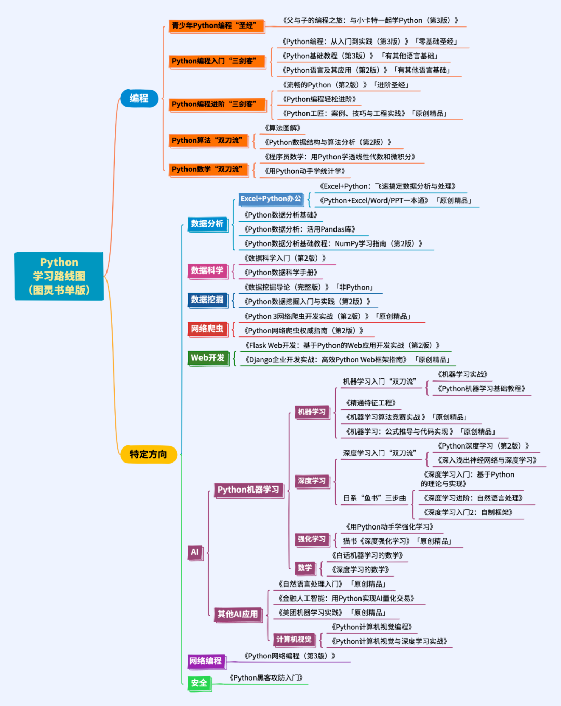

# Python tips
-------------------


#### 1. python通过MingW调用C/C++, 编写C/C++,用gcc或者g++调用生成dll文件，通过ctypes包进行调用，代码示例如下:
python代码:
``` python
import ctypes
dll = ctypes.CDLL('test.dll',winmode=0) #加载动态链接库
f=dll.add #提取函数
f.argtypes=[ctypes.c_double,ctypes.c_double] #定义参数类型
f.restype=ctypes.c_double #定义函数返回值类型
cons = f(2.5,3.5) #计算
print(cons)
```
cpp代码:
```c
extern "C" {
	__declspec(dllexport) double add(double x,double y);
}

double add(double x,double y){
	return x+y;
}
```
gcc的编译代码:
```shell
g++ -shared -Wl,--kill-at,--output-def,test.def -o test.dll test.cpp
```

#### 2.Python的C扩展可以用ctypes可以利用python.h的头文件，举例如下：
``` C
#include <Python.h>

// 扩展函数
static PyObject* add_numbers(PyObject* self, PyObject* args) {
    int num1, num2, result;

    // 解析参数
    if (!PyArg_ParseTuple(args, "ii", &num1, &num2)) {
        return NULL;
    }

    // 执行计算
    result = num1 + num2;

    // 将结果转换为Python对象并返回
    return Py_BuildValue("i", result);
}

// 扩展模块定义
static PyMethodDef ExampleMethods[] = {
    {"add_numbers", add_numbers, METH_VARARGS, "Add two numbers."},
    {NULL, NULL, 0, NULL}  // 结束标记
};

// 扩展模块初始化函数
static struct PyModuleDef examplemodule = {
    PyModuleDef_HEAD_INIT,
    "example",   // 模块名
    NULL,        // 模块文档
    -1,          // 模块状态
    ExampleMethods
};

// 扩展模块初始化
PyMODINIT_FUNC PyInit_example(void) {
    return PyModule_Create(&examplemodule);
}
```
然后通过:
``` shell
gcc -shared -o example.so example.c -I /usr/include/python3.x/
```
编译成功后，将生成一个名为example.so的共享库文件，导入即可使用。

```python
安装指定版本gym
pip install gym==0.20.0 -i https://pypi.douban.com/simple
pip install pyglet==1.5.27

通过网站搜索包下载:
https://www.lfd.uci.edu/~gohlke/pythonlibs/

常用的python下载源:
中国科学技术大学
https://pypi.mirrors.ustc.edu.cn/simple 
阿里云
http://mirrors.aliyun.com/pypi/simple/
豆瓣
http://pypi.douban.com/simple/
用的时候在前面
-i

python官方下载源
https://pypi.org/

查看python所有的环境
conda info --env
```


gym环境从0.21到的0.26的变化

https://gymnasium.farama.org/content/migration-guide/

gym 0.26教程

https://www.gymlibrary.dev/content/basic_usage/


#### 3.  numpy pytorch的一些用法

.view(1,-1) 是拉成一行，并且会加一个[]，变成一个二维[[]]


tensor的item()函数，只有一个元素时可以取里面的元素

```python
import torch

# 创建一个张量，包含一个单独的元素
x = torch.tensor([42])

# 使用item()函数提取元素
element = x.item()

print(element)  # 这将打印出 42，一个Python整数

```

